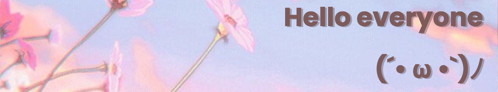

  

---
[%EF%BE%89*%3A%EF%BD%A5%EF%BE%9F%E2%9C%A7)](https://git.io/typing-svg)

I'm currently working on the last year of my BS in Computer Science and am so excited (but also scared) to start a life in the tech industry next year. In this last year, I'm trying to learn as much as I can to be ready for Industry and I'm having a lot of fun doing so!
___
[)](https://git.io/typing-svg)

       

I have the most experience with using Python, Java, and C++ due to school. Though I know those the best, I've also been learning HTML5, CSS3, JavaScript, React, and C/C# for personal projects I've been working on. I'm currently working on numerous webapps and will upload them here to showcase my work to the world. However, I know I can always improve and would like feedback on how I can better them
___

~ Please let me know if you ever want to collaborate and/or wish to give me any advice on my code or anything else you think would benefit me! ~

Fun Fact: My profile pic is from a franchise that I love and I chose it since it felt more me than putting my actual face ʕ •ᴥ• ʔ
